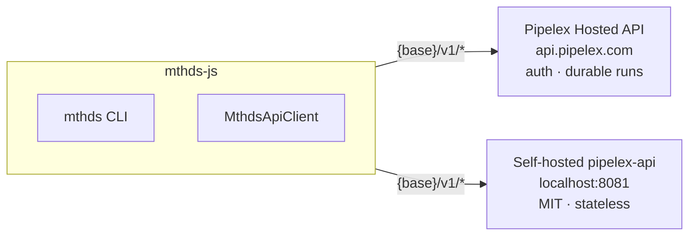

# Using a runner API — hosted or self-hosted

`mthds-js` runs methods either with the **local `pipelex` runner** (a Python CLI on your machine, the default) or with an **HTTP runner** — an MTHDS-compliant API server. This page is about the HTTP runner: how to point the CLI and SDK at one.

There are two common targets, and the same `MthdsApiClient` and `mthds` CLI drive both:

- **Pipelex Hosted API** — the managed runner at `https://api.pipelex.com` (the default). Authenticated, with durable runs.
- **Self-hosted** — a bare [OSS `pipelex-api`](https://github.com/Pipelex/pipelex-api) runner you boot yourself (MIT, stateless).

The MTHDS Protocol surface is identical on both. The only things that change are the **base URL** and whether you need a key.



## One base URL

There is a single configuration pair. The base URL is the **host only — no version prefix**; the SDK composes every endpoint as `{base}/v1/{endpoint}`.

| Config key | Env var | Default |
|---|---|---|
| `base-url` | `MTHDS_BASE_URL` | `https://api.pipelex.com` |
| `api-key` | `MTHDS_API_KEY` | (empty) |

So `execute` hits `<base>/v1/execute`, `validate` hits `<base>/v1/validate`, and so on. `/health` is the exception — it is origin-level, resolving to `<scheme>://<host>/health`, not under `/v1`.

Environment variables take precedence over the config file. The `MthdsApiClient` constructor reads `MTHDS_BASE_URL` / `MTHDS_API_KEY` as fallbacks, and an explicit `baseUrl` / `apiKey` overrides them — the constructor doesn't read the config file itself; the CLI loads the file and passes the resolved values in. Configuration is stored in `~/.mthds/config` and shared with `mthds-python`.

> The base URL must be host-only — `http`/`https`, no path, query, fragment, or credentials. A path-prefixed value such as `…/v1` would compose into a malformed `/v1/v1/…` endpoint, so the client rejects it up front.

## Hosted vs. self-hosted at a glance

| | Pipelex Hosted API | Self-hosted bare runner |
|---|---|---|
| Base URL | `https://api.pipelex.com` (default) | your host, e.g. `http://localhost:8081` |
| API key | required | optional (anonymous is fine) |
| Protocol surface (`execute` / `start` / `validate` / `models` / `version`) | ✅ | ✅ |
| Synchronous request cap | ~30s (gateway) | none from the runner — bounded by your reverse proxy |
| Durable poll-by-id (`/v1/runs/*`) | ✅ via [`@pipelex/sdk`](./run-lifecycle.md) | ❌ stateless — those routes `404` |
| Client-supplied `pipeline_run_id` | rejected (`422`) | accepted (passed via `extra`) |

## Setup

### Hosted (default)

```bash
mthds config set runner api          # switch from the local pipelex runner to the HTTP runner
mthds config set base-url https://api.pipelex.com
mthds config set api-key YOUR_KEY
```

Or run `mthds runner setup api` for an interactive prompt (base URL + masked key).

### Self-hosted

Boot a bare runner, then point at it — no key needed:

```bash
mthds config set runner api
mthds config set base-url http://localhost:8081
```

See [pipelex-api](https://github.com/Pipelex/pipelex-api) for how to run the server.

## How runs behave against each

**Synchronous runs.** `mthds run pipe` and `mthds run bundle` call the blocking `POST /v1/execute` (see [run-lifecycle.md](./run-lifecycle.md)).

- *Hosted:* the gateway caps synchronous requests at ~30s; a longer run raises `PipelineExecuteTimeoutError`.
- *Self-hosted:* the runner holds the connection as long as it needs, but your own reverse proxy (nginx, ALB, Cloud Run, …) typically imposes an idle timeout (~60s). Raise it for long runs.

For anything long-running, prefer `start` over `execute`. The async `start` primitive is part of the **SDK** (`client.start`), not a CLI subcommand — `mthds run …` is always synchronous.

**Durable poll-by-id.** Submitting a run and later polling it by `pipeline_run_id` is a hosted-API feature provided by [`@pipelex/sdk` / `pipelex-agent`](./run-lifecycle.md), not by `mthds-js`. A bare runner is stateless and has no run store, so its `/v1/runs/*` routes `404`. For fire-and-forget completion against a bare runner, `pipelex-api` offers HMAC-signed webhooks via its `callback_urls` extension arg (passed through `extra`).

**Output shape.** The blocking `execute` path returns the runner's native `pipe_output`. The hosted durable path (in `@pipelex/sdk`) instead returns `main_stuff` + `graph_spec`. For v1 this difference is documented, not normalized (TODO).

**Custom-PipeFunc method bundles.** A method whose pipes call custom Python (`funcs/*.py`, and any `structures/*.py` / `requirements.txt`) is more than its `.mthds` text. When `mthds run bundle` / `mthds run pipe` target a **directory** — or a `.mthds` file whose directory carries custom Python — the CLI ships the whole bundle instead of just the `.mthds`:

- Against the **API runner**, the bundle travels as the pipelex-api `files` extension (a `{ relativePath: text }` map on the run request); the runner materializes it into a temporary library directory before the run, so the custom Python travels with the method. (Custom `.py` is only executed on a sandbox-hosted deployment — a non-sandbox runner rejects it with `CustomCodeRequiresSandbox`.)
- Against the **pipelex runner**, the same bundle is written back to a temp directory and run locally with `-L`, so the `funcs/*.py` resolve.

A plain `.mthds` file with no custom Python keeps the lighter single-content path (`mthds_contents`) — nothing changes for the common case. `files` is the SDK's `RunOptions.files` field (or `bundle_b64` for a zipped bundle); both are mutually exclusive with `mthds_contents`.

**Minimum server version.** The SDK composes every endpoint under `/v1`, so a self-hosted runner must mount its API at `/v1` (the MTHDS Protocol cutover). Older images mounted `/api/v1` and answer `404` on every call — including the `/v1/version` handshake. Upgrade your runner image before (or together with) this SDK version.

## SDK

```typescript
import { MthdsApiClient } from "mthds";

// Hosted
const hosted = new MthdsApiClient({
  baseUrl: "https://api.pipelex.com",
  apiKey: "your-api-key",
});

// Self-hosted (bare runner)
const selfHosted = new MthdsApiClient({
  baseUrl: "http://localhost:8081",
  // apiKey optional for an anonymous bare runner
});
```

With no options, the constructor reads `MTHDS_BASE_URL` and `MTHDS_API_KEY` from the environment, falling back to the hosted default.

## See also

- [run-lifecycle.md](./run-lifecycle.md) — `execute` vs. `start`, and durable poll-by-id.
- [build-routes.md](./build-routes.md) — the `/v1/build/*` projections: the shared `files[]` envelope, the qualified `pipe_ref` selector, and the `is_valid` verdict.
- [architecture.md](./architecture.md) — the SDK's protocol/runner split and the `MthdsApiClient` surface.
- [errors.md](./errors.md) — the exception taxonomy: `PipelineExecuteTimeoutError`, `ApiResponseError`, `ApiUnreachableError`, and the rest.
- [pipelex-api](https://github.com/Pipelex/pipelex-api) — the OSS runner's own OpenAPI contract and quickstart (`docs/index.md`), plus the MTHDS Protocol spec (`mthds-protocol.openapi.yaml`) in the standard repo.
