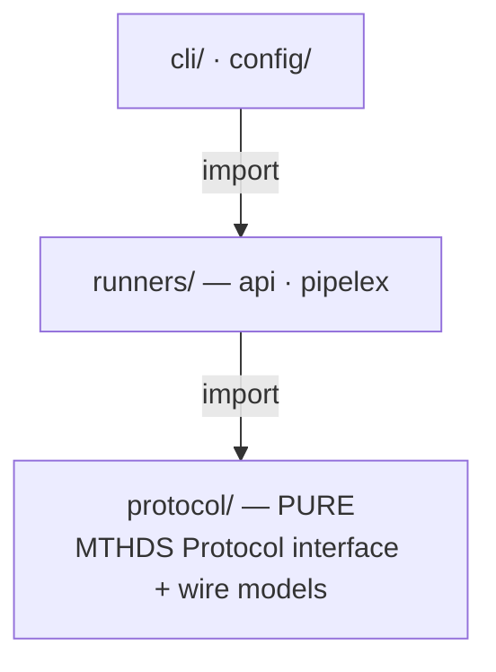

# SDK architecture — `protocol/` ⊥ `runners/`

The SDK is split into two layers that mirror `mthds-python` (`mthds/protocol/` ⊥ `mthds/runners/`):

- **`src/protocol/` — the pure MTHDS Protocol.** The interface and wire models, exactly what `mthds-protocol.openapi.yaml` defines — no more, no less. It imports **nothing** from `runners/`, `cli/`, `agent/`, or `config/`.
- **`src/runners/` — the implementations.** The API client/runner, the local `pipelex` CLI runner, and the shared `Runner` supertype the CLI programs against.



Arrows point in the **import** direction. `protocol/` is the leaf — it depends on nothing internal. A `.dependency-cruiser.cjs` rule (run in `make check`) enforces that boundary, so the pure layer can never quietly grow a dependency on a runner, the CLI, or config.

## Module map

```
src/protocol/                 PURE — the MTHDS Protocol mirror (imports nothing from runners/cli/config)
  protocol.ts                 MTHDSProtocol<PipeOutputT> — execute/start/validate/models/version (GENERIC)
  models.ts                   RunResultExecute<T>, RunResultStart, ModelDeck/Info/Category,
                              ValidationResult (ValidationReport | InvalidValidationReport) + ValidationError,
                              VersionInfo, MTHDS_PROTOCOL_VERSION — slim + extension-open
  options.ts                  RunRequest/StartRequest, RunOptions/StartOptions, ExtensionOptions (the arg surface)
  pipeline_inputs.ts          StuffContentOrData, PipelineInputs
  pipe_output.ts              VariableMultiplicity, PipeOutputAbstract<TWorkingMemory>
  pipe_io_contracts.ts        PipeIOContracts (pipe_ref → PipeIOContract: inputs → PipeInputContract, output →
                              PipeOutputContract), IOMultiplicity, PresenceMarker — the validate extension
                              `pipe_io_contracts` (mirror of mthds/protocol/pipe_io_contracts.py)
  input_form.ts               InputForm (pipe_ref → PipeInputFormDescriptor), the recursive InputFormField /
                              InputFormItem discriminated on FieldKind (FIELD_KINDS at run time), IntentHints —
                              the validate extension `input_form` (mirror of mthds/protocol/input_form.py)
  inputs_template.ts          renderInputsTemplate / projectInputsTemplate / projectConceptComments /
                              formatSlotSignature — one pipe's fill-in inputs template, projected from its
                              input-form descriptor (mirror of mthds/protocol/inputs_template.py)
  toml_emitter.ts             the deterministic TOML layout the two projections share, TemplateFloat and the
                              TemplateValue shapes (mirror of mthds/protocol/toml_emitter.py)
  concept.ts                  ConceptAbstract + conceptRef()
  stuff.ts                    StuffAbstract<TConcept, TContent>, StuffContentAbstract
  working_memory.ts           WorkingMemoryAbstract<TStuff>
  exceptions.ts               PipelineRequestError (protocol-level base)
src/runners/api/
  client.ts                   MthdsApiClient — IS the api runner: implements Runner (protocol + build extensions)
  models.ts                   DictStuff/DictWorkingMemory/DictPipeOutput + DictRunResultExecute (default binding);
                              ValidationErrorItem/Category (the build routes' 422 error item) — the Pipelex
                              /v1/validate narrowing (PipelexValidationResult) now lives in @pipelex/sdk
  exceptions.ts               ApiResponseError (+ validationErrors), ApiUnreachableError, ClientAuthenticationError,
                              RunStillRunningError, PipelineExecuteTimeoutError
src/runners/pipelex/
  runner.ts                   PipelexRunner (local CLI runner)
src/runners/
  types.ts                    Runner interface (extends MTHDSProtocol<DictPipeOutput>) + Runners enum + build types
  registry.ts                 createRunner() factory
src/index.ts                  public barrel → re-exports protocol/ + runners/
src/errors.ts                 client-safe error subpath (mthds/errors) → re-exports the exception classes only
```

## Entry points

The package's entry points differ in what they drag into a bundler's graph:

| Import | Source | Carries | Bundles where | Use for |
|---|---|---|---|---|
| `mthds` | `src/index.ts` | protocol surface + `MthdsApiClient` + error classes | **server/Node** (statically pulls `MthdsApiClient → config/ → node:fs`) | the full SDK |
| `mthds/protocol` | `src/protocol/index.ts` | the pure protocol surface — types + runtime values (`PipelineRequestError`, `MTHDS_PROTOCOL_VERSION`/`MODEL_CATEGORIES`/`FIELD_KINDS`, `conceptRef`, the run-source predicates `assertExclusiveRunSources`/`hasBundlePayload`, the method-file serialization `serializeMethodFiles`/`parseMethodFiles`, the inputs-template projection `renderInputsTemplate`/`projectInputsTemplate`/`projectConceptComments`/`formatSlotSignature` with `INPUTS_TEMPLATE_FORMATS`, `TemplateFloat` and the two errors `InputsTemplateError`/`TomlEmissionError`) | isomorphic | the protocol surface, with no runner or Node deps |
| `mthds/errors` | `src/errors.ts` | the exception classes only | **client-safe** (no `node:fs`) | `instanceof` checks in client code |

### Why `mthds/errors` exists

The top-level barrel can't be imported from a client bundle: re-exporting `MthdsApiClient` drags `config/ → node:fs` into the graph, which a bundler like Turbopack cannot externalize — even for a consumer that only wanted an error class for an `instanceof` check (a Next.js client component classifying a Server Action rejection is the motivating case).

So `mthds/errors` re-exports only the exception classes — `ApiResponseError`, `ApiUnreachableError`, `ClientAuthenticationError`, `PipelineExecuteTimeoutError`, `RunStillRunningError`, and the protocol base `PipelineRequestError`. Its graph is `protocol/exceptions` (zero imports) plus `runners/api/exceptions` (whose only runtime import is `protocol/exceptions`), so it carries no `node:fs` and survives a browser/client bundler. Client-reachable code imports error classes from here; server code that needs the client keeps importing `MthdsApiClient` from `mthds`. The two error sets cannot drift — both re-export from the same source modules.

See [errors.md](./errors.md) for the full taxonomy — each class's fields, when it is thrown, the inheritance tree, and how to classify an error in client code.

## Design decisions

### The protocol interface is generic

`MTHDSProtocol<PipeOutputT>` is generic so `protocol/` never names a runner-side concrete. `execute` returns `RunResultExecute<PipeOutputT>`; the default `DictPipeOutput` binding — `DictRunResultExecute = RunResultExecute<DictPipeOutput>` — lives in `runners/api/models.ts`, not in the protocol. `Runner` binds it as `MTHDSProtocol<DictPipeOutput>`. The generic is the mechanism that keeps the boundary pure.

### The run response is split

| Response | From | Fields | Why |
|---|---|---|---|
| `RunResultExecute<T>` | `execute` (200) | `pipeline_run_id`, `pipe_output` | a completed run always has output |
| `RunResultStart` | `start` (202) | `pipeline_run_id` | a started run has no output yet; how it is later delivered (polling, callbacks) is implementation-defined and outside the protocol |

Both are **extension-open** (an index signature): anything more an implementation returns (`state`, `created_at`, `main_stuff_name`, …) is preserved but never named by the SDK. The discovery models (`ModelDeck`, `VersionInfo`) and the valid arm `ValidationReport` are slim + extension-open the same way.

### `/validate` is a 200-diagnostic surface

`POST /validate` is a diagnostic endpoint: **every produced verdict rides a `200`**, discriminated in the body on the mandatory `is_valid` field. A non-2xx is reserved for *no-verdict* conditions — a malformed request, an `mthds_sources` length mismatch, auth, a server fault — which throw `ApiResponseError`. A consumer pattern-matches `is_valid`; it never branches on a status code or a caught exception body.

The protocol layer models the verdict as `ValidationResult = ValidationReport (is_valid: true) | InvalidValidationReport (is_valid: false)`, and that neutral union is what `MthdsApiClient.validate()` returns — the standard's client speaks the standard's verdict:

| Arm | Discriminant | Carries |
|---|---|---|
| `ValidationReport` | `is_valid: true` | only the discriminant; any structural artifacts the server adds (`bundle_blueprint`, `graph_spec`, `validated_pipes`, …) ride the extension index signature — preserved but untyped, except the two the standard recommends, `pipe_io_contracts` and `input_form`, which have types to narrow by (see below) |
| `InvalidValidationReport` | `is_valid: false` | `validation_errors[]` (typed `ValidationError` = `category` + `message`, non-empty on every invalid verdict), `pending_signatures`, `is_runnable: false`, `message` |

- **The Pipelex-API narrowing lives in `@pipelex/sdk`, not here.** `PipelexValidationResult` (its `PipelexValidationReport` / `PipelexInvalidReport` arms typing `bundle_blueprint`, `graph_spec`, `validated_pipes`, the closed-vocabulary `validation_errors[]`, and the opt-in `rendered_markdown`) is owned by the runtime SDK. A consumer that wants the typed Pipelex artifacts uses `@pipelex/sdk`'s `PipelexApiClient`; `mthds` keeps to the standard. This is the MTHDS/Pipelex brand boundary: the standard's client returns the standard's neutral verdict. The two artifacts the standard itself owns — `pipe_io_contracts` and `input_form` — are the exception, typed here and imported by the SDK rather than restated (see the next section).
- `mthds_sources` (a third, optional, parallel-array arg to `validate()`) names each submitted content so the server threads `blueprint.source` for cross-file diagnostics (an unnamed content yields `source: null`).
- `ValidationErrorItem` (+ the closed `ValidationErrorCategory`, incl. `dry_run`) — the one structured per-error item — stays in `mthds` because the **build routes'** `422` problem body parses it onto `ApiResponseError.validationErrors` (`undefined` for any error with no per-error list). It is neutrally named, so no brand violation; the SDK's `/v1/validate` narrowing reuses the same shape.
- `VersionInfo.implementation_version` — the one well-known `VersionInfo` extension is typed (still optional) so capability gating reads `version().implementation_version` directly.

### The standard's recommended validate extensions are typed here

MTHDS v0.9.0 gave two validate artifacts pages of their own — [Pipe I/O Contracts](https://mthds.ai/spec/pipe-io-contracts/) (`mthds/docs/spec/pipe-io-contracts.md`) and [Input-Form Descriptor](https://mthds.ai/spec/input-form-descriptor/) (`mthds/docs/spec/input-form-descriptor.md`, with the `hints` slot's shape from [Intent Hints](https://mthds.ai/spec/intent-hints/)) — and names them in the protocol as **recommended extension fields** of the validate response, `pipe_io_contracts` and `input_form`. The protocol's base fields did not change, so they are not fields of `ValidationReport`; they ride its extension index signature, and `src/protocol/pipe_io_contracts.ts` and `src/protocol/input_form.ts` are the types a consumer narrows them by (`report.input_form as InputForm`). The modules are exact mirrors of `mthds/protocol/pipe_io_contracts.py` and `mthds/protocol/input_form.py`, so a payload parsed by one mirror types against the other; the Pipelex SDKs and the `@pipelex/mthds-form` kernel import these rather than restating the wire shape.

What the types say, in the pages' own terms:

- **`PipeIOContracts`** — `pipe_ref` → `PipeIOContract` (`inputs`: name → `PipeInputContract`, `output`: `PipeOutputContract`). An input carries `concept_ref` (multiplicity suffix stripped), the three-valued `presence` (`PresenceMarker`: `plain` | `optional` | `force`, so `!` survives), `multiplicity` (`IOMultiplicity`: `single` | `variable` | `fixed`), `item_count` and `json_schema`; an output carries `concept_ref`, `multiplicity`, `item_count` and a two-valued `optional` (a force marker never appears on an output). `item_count` is **always on the wire** here, `null` off the fixed arm. Both contracts are unions discriminated on `multiplicity`, so the pages' pairing rules are the type rather than prose beside it: `item_count` is `number` exactly on the fixed arm, and because markers may not combine with multiplicity, a plural input is always `presence: "plain"` and a plural output is never `optional: true`. The one pairing a type cannot state — a fixed count is always greater than one — stays a producer obligation.
- **`InputForm`** — `pipe_ref` → `PipeInputFormDescriptor`, whose `fields` list is **ordered** (authored input order — the order the contract's `inputs` map deliberately does not carry). Each field is an `InputFormField`, a recursive node discriminated on the closed `kind` union (`FieldKind`; `FIELD_KINDS` at run time) with the per-kind slots the page defines — `datetime` on `date`, `integer` and the four bounds on `number`, `choices` on `enum`, `fields` on `object`, `item` and the fixed-arm-only `item_count` on `list`, the text constraints on `text` / `prose` — plus the common slots (`concept_ref`, `refines`, `required`, `default_value`, `examples`, `hints`). A `list`'s `item` is an `InputFormItem`: the same node minus `name`, because an item has no authored name; a descriptor's `fields` entry is an `InputFormTopLevelField`: an `InputFormField` plus the two **required** pipe-slot facts `presence` and `gating`, which the page scopes to top-level fields only and which therefore appear on no nested shape. That layer is a union discriminated on `required`, so the page's derivations are the type rather than prose: `required` restates the marker (`required: true` pairs only with `"plain"` or `"force"`, `required: false` only with `"optional"` — the pairing `mthds-python` rejects at the parse), and the optional arm pins `gating: false`, the gating table's `Concept?` row. The one derivation a type cannot state — a variable list is required yet never gates — stays a producer obligation. Inapplicable slots are **absent**, never `null`, so every conditional slot is an optional property; `item_count` is absent off the fixed arm — the deliberate opposite of the contract.
- **Closed shapes, open report.** Every object the two pages define is closed: an unknown member is version drift a producer must not emit and a consumer may reject. The validate *report* stays extension-open, as before. The `hints` map is the one exception, in content and not in shape — unknown keys and unknown `intent` words are carried through.
- **Types only.** There is no runtime validator in `protocol/`; engines own their emission gates (`pipelex` validates with the `mthds.protocol` models, `@pipelex/runtime` with its Zod schema) and are pinned to these types. The one runtime value is `FIELD_KINDS`, the `const` tuple the `FieldKind` union is derived from — the `MODEL_CATEGORIES` precedent — so a renderer can guard `kind` exhaustively at run time.

**The parity fixture.** `tests/fixtures/protocol/` holds one real payload pair of both artifacts, emitted by the reference engine and committed byte-for-byte identical in `mthds-python`, where the pydantic mirror parses it — that identity is how the two mirrors are checked against one payload. `npm run fixtures:protocol` generates a `.fixture.ts` twin per JSON — the payload as a fresh object literal declared `InputForm` / `PipeIOContracts` — which is the compile-time check: `npm run typecheck:test` fails when the fixture and the types disagree. `tests/unit/protocol/input-form-parity.test.ts` asserts each twin deep-equals its JSON and checks the cross-artifact rules the pages state (shared key set, closed vocabularies, how `presence`, `required`, `gating` and `item_count` line up between a slot's contract and its descriptor). Where the engine is known to disagree with a page, the page wins: the types follow the page, the fixture stays what the engine produced — never edited to hide the difference — and the README beside it names the ledger item that tracks each divergence. The current capture carries none: it is what `pipelex-dev generate-projection-corpus` emits over the bundles `tests/fixtures/protocol/README.md` names, in the order it names them, taken after the engine caught up to MTHDS v0.9.0, and it conforms at every site it reaches.

### The inputs template is projected from the descriptor, not fetched

A pipe's **fill-in inputs template** — what a person at a form or an agent preparing a run fills in and hands back — used to be built server-side and fetched over HTTP (`POST /v1/build/inputs`). It is projected here instead, from the `input_form` descriptor the standard already defines, so a client holding a descriptor needs nothing further to offer a template for a method it does not have on disk. `renderInputsTemplate(descriptor, { explicit, format })` is the entry point; `projectInputsTemplate` returns the template as a value, `projectConceptComments` and `formatSlotSignature` build the io-ref notation (`Concept`, `Concept[]`, `Concept[2]`, `Concept?`, `Concept!`) a compact TOML rendering carries above each key.

Two shapes, and the difference is what the runtime's own input shaper can take back. The **compact** shape is the light form a smart-inputs run accepts directly — a bare string for a text slot, a bare URL for a file-ish one, the content mapping for a structured one — except where a bare value is not re-shapable, which keeps the `{concept, content}` envelope because a template that does not run is not a template. The **explicit** shape keeps that envelope on every slot. The projection walks the *descriptor*, never a runtime content class, which is the whole difference from the reference engine's own renderer: the engine's template states what the runtime holds, this one states what the method declares. Each class of difference is declared, with worked sites, in the corpus manifest.

**The bar is byte identity with `mthds-python`**, across every kind of the closed vocabulary, both shapes and both formats — otherwise the JS/Python asymmetry that retiring the build routes removed is rebuilt one layer up. Two consequences for how this is written. The TOML is emitted by `toml_emitter.ts` rather than by `smol-toml`: a library emits no comments and may change its layout in a patch release, in one language and not the other, so the layout is stated in the few dozen lines it takes and mirrored line for line. And a number carries a `TemplateFloat` marker where it must print with its decimal point — TypeScript has one number type where Python has two, so `0.0` would otherwise print as `0` — which is also why the JSON half is written here rather than handed to `JSON.stringify`.

`tests/fixtures/protocol/inputs_template/` is the corpus that holds the two sides to it: one file per pipe, shape and format, committed identically in both repos. The rules the captured bundles do not reach are stated on their own — each TOML layout rule as bytes in `toml-emitter.test.ts`, and the forms no capture produced (an input-less pipe, a plural native slot, an unknown format) in `inputs-template-rendering.test.ts`.

Wiring `mthds-agent inputs` on the API runner onto this projection — and off `POST /v1/build/inputs` — is the second half of `L-260829-f50e2b`, and waits on the descriptor's own route.

### Token precedence

In the constructor, an explicitly-passed `apiKey` wins over `MTHDS_API_KEY` from the environment (`options.apiKey ?? process.env.MTHDS_API_KEY`), so a wrapper — e.g. the VS Code extension's SecretStorage — can override a native env read.

### The API client *is* the API runner

There is one class, not a client wrapped by a runner. `MthdsApiClient implements Runner`:

- **`pipelex-app`** instantiates it directly and uses its protocol subset (`execute`, `start`, `validate`, `version`).
- **The CLI** gets it via `createRunner('api')`, which wires the config-derived base URL + token, and uses the full `Runner` surface (protocol + build extensions + `health`).

## Run lifecycle lives in `@pipelex/sdk`

`mthds-js` implements the protocol's `start` (`POST /v1/start`), which hands back the authoritative `pipeline_run_id`. The **durable run-lifecycle** — polling a run by id until it reaches a terminal state — is a hosted-API extension, not part of `MTHDSProtocol`, and lives in the Pipelex runtime SDK (`@pipelex/sdk` / `pipelex-agent`). That keeps this package scoped to the protocol surface. See [run-lifecycle.md](./run-lifecycle.md).

## See also

- [errors.md](./errors.md) — the full exception taxonomy (`mthds/errors`): each class, its fields, when it is thrown, and client-side classification.
- [run-lifecycle.md](./run-lifecycle.md) — the `execute` / `start` run model these types back.
- [api-runner.md](./api-runner.md) — pointing the client at a hosted or self-hosted runner.
