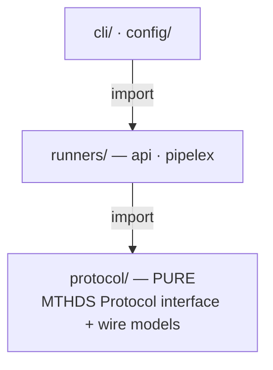

# SDK architecture — `protocol/` ⊥ `runners/`

The SDK is split into two layers that mirror `mthds-python` (`mthds/protocol/` ⊥ `mthds/runners/`):

- **`src/protocol/` — the pure MTHDS Protocol.** The interface and wire models, exactly what `mthds-protocol.openapi.yaml` defines — no more, no less. It imports **nothing** from `runners/`, `cli/`, `agent/`, or `config/`.
- **`src/runners/` — the implementations.** The API client/runner, the local `pipelex` CLI runner, and the shared `Runner` supertype the CLI programs against.



Arrows point in the **import** direction. `protocol/` is the leaf — it depends on nothing internal. A `.dependency-cruiser.cjs` rule (run in `make check`) enforces that boundary, so the pure layer can never quietly grow a dependency on a runner, the CLI, or config.

## Module map

```
src/protocol/                 PURE — the MTHDS Protocol mirror (imports nothing from runners/cli/config)
  protocol.ts                 MTHDSProtocol<PipeOutputT> — execute/start/validate/models/version (GENERIC)
  models.ts                   RunResultExecute<T>, RunResultStart, ModelDeck/Info/Category,
                              ValidationResult (ValidationReport | InvalidValidationReport) + ValidationError,
                              VersionInfo, MTHDS_PROTOCOL_VERSION — slim + extension-open
  options.ts                  RunRequest/StartRequest, RunOptions/StartOptions, ExtensionOptions (the arg surface)
  pipeline_inputs.ts          StuffContentOrData, PipelineInputs
  pipe_output.ts              VariableMultiplicity, PipeOutputAbstract<TWorkingMemory>
  concept.ts                  ConceptAbstract + conceptRef()
  stuff.ts                    StuffAbstract<TConcept, TContent>, StuffContentAbstract
  working_memory.ts           WorkingMemoryAbstract<TStuff>
  exceptions.ts               PipelineRequestError (protocol-level base)
src/runners/api/
  client.ts                   MthdsApiClient — IS the api runner: implements Runner (protocol + build extensions)
  models.ts                   DictStuff/DictWorkingMemory/DictPipeOutput + DictRunResultExecute (default binding);
                              PipelexValidationResult (PipelexValidationReport | PipelexInvalidReport) +
                              ValidatedPipeEntry/DryRunStatus + ValidationErrorItem/Category
  exceptions.ts               ApiResponseError (+ validationErrors), ApiUnreachableError, ClientAuthenticationError,
                              RunStillRunningError, PipelineExecuteTimeoutError
src/runners/pipelex/
  runner.ts                   PipelexRunner (local CLI runner)
src/runners/
  types.ts                    Runner interface (extends MTHDSProtocol<DictPipeOutput>) + Runners enum + build types
  registry.ts                 createRunner() factory
src/index.ts                  public barrel → re-exports protocol/ + runners/
src/errors.ts                 client-safe error subpath (mthds/errors) → re-exports the exception classes only
```

## Entry points

The package's entry points differ in what they drag into a bundler's graph:

| Import | Source | Carries | Bundles where | Use for |
|---|---|---|---|---|
| `mthds` | `src/index.ts` | protocol surface + `MthdsApiClient` + error classes | **server/Node** (statically pulls `MthdsApiClient → config/ → node:fs`) | the full SDK |
| `mthds/protocol` | `src/protocol/index.ts` | the pure protocol surface (types only) | isomorphic | types, with no runner or Node deps |
| `mthds/errors` | `src/errors.ts` | the exception classes only | **client-safe** (no `node:fs`) | `instanceof` checks in client code |

### Why `mthds/errors` exists

The top-level barrel can't be imported from a client bundle: re-exporting `MthdsApiClient` drags `config/ → node:fs` into the graph, which a bundler like Turbopack cannot externalize — even for a consumer that only wanted an error class for an `instanceof` check (a Next.js client component classifying a Server Action rejection is the motivating case).

So `mthds/errors` re-exports only the exception classes — `ApiResponseError`, `ApiUnreachableError`, `ClientAuthenticationError`, `PipelineExecuteTimeoutError`, `RunStillRunningError`, and the protocol base `PipelineRequestError`. Its graph is `protocol/exceptions` (zero imports) plus `runners/api/exceptions` (which imports only `protocol/exceptions`), so it carries no `node:fs` and survives a browser/client bundler. Client-reachable code imports error classes from here; server code that needs the client keeps importing `MthdsApiClient` from `mthds`. The two error sets cannot drift — both re-export from the same source modules.

## Design decisions

### The protocol interface is generic

`MTHDSProtocol<PipeOutputT>` is generic so `protocol/` never names a runner-side concrete. `execute` returns `RunResultExecute<PipeOutputT>`; the default `DictPipeOutput` binding — `DictRunResultExecute = RunResultExecute<DictPipeOutput>` — lives in `runners/api/models.ts`, not in the protocol. `Runner` binds it as `MTHDSProtocol<DictPipeOutput>`. The generic is the mechanism that keeps the boundary pure.

### The run response is split

| Response | From | Fields | Why |
|---|---|---|---|
| `RunResultExecute<T>` | `execute` (200) | `pipeline_run_id`, `pipe_output` | a completed run always has output |
| `RunResultStart` | `start` (202) | `pipeline_run_id` | a started run has no output yet; how it is later delivered (polling, callbacks) is implementation-defined and outside the protocol |

Both are **extension-open** (an index signature): anything more an implementation returns (`state`, `created_at`, `main_stuff_name`, …) is preserved but never named by the SDK. The discovery models (`ModelDeck`, `VersionInfo`) and the valid arm `ValidationReport` are slim + extension-open the same way.

### `/validate` is a 200-diagnostic surface

`POST /validate` is a diagnostic endpoint: **every produced verdict rides a `200`**, discriminated in the body on the mandatory `is_valid` field. A non-2xx is reserved for *no-verdict* conditions — a malformed request, an `mthds_sources` length mismatch, auth, a server fault — which throw `ApiResponseError`. A consumer pattern-matches `is_valid`; it never branches on a status code or a caught exception body.

The protocol layer models the verdict as `ValidationResult = ValidationReport (is_valid: true) | InvalidValidationReport (is_valid: false)`. The API runner narrows both arms — the Pipelex API fills them with a known body — so consumers (the VS Code extension, `pipelex-app`) don't reach through the index signature:

| Arm | Discriminant | Carries |
|---|---|---|
| `PipelexValidationReport` | `is_valid: true` | `bundle_blueprint`, `pipe_io_contracts`, `graph_spec`, `validated_pipes`, `pending_signatures`, `is_runnable` (+ the route's `message` / `mthds_contents` echo) |
| `PipelexInvalidReport` | `is_valid: false` | `validation_errors[]` (non-empty on every invalid verdict), `pending_signatures`, `is_runnable: false`, `message` — no structural artifacts |

- `PipelexValidationResult` = `PipelexValidationReport | PipelexInvalidReport` is the union `MthdsApiClient.validate()` returns.
- `bundle_blueprint` / `pipe_io_contracts` / `graph_spec` stay **opaque transport** — their canonical schemas are owned by the runtime and `@pipelex/mthds-ui`.
- `mthds_sources` (a third, optional, parallel-array arg to `validate()`) names each submitted content so the server threads `blueprint.source` for cross-file diagnostics (an unnamed content yields `source: null`).
- `ValidationErrorItem` (+ the closed `ValidationErrorCategory`, incl. `dry_run`) is one structured per-error item. It rides the 200 invalid arm on `/validate`, and the **build routes'** `422` problem body parses the same typed item onto `ApiResponseError.validationErrors` (`undefined` for any error with no per-error list).
- `VersionInfo.implementation_version` — the one well-known `VersionInfo` extension is typed (still optional) so capability gating reads `version().implementation_version` directly.

### Token precedence

In the constructor, an explicitly-passed `apiToken` wins over `MTHDS_API_KEY` from the environment (`options.apiToken ?? process.env.MTHDS_API_KEY`), so a wrapper — e.g. the VS Code extension's SecretStorage — can override a native env read.

### The API client *is* the API runner

There is one class, not a client wrapped by a runner. `MthdsApiClient implements Runner`:

- **`pipelex-app`** instantiates it directly and uses its protocol subset (`execute`, `start`, `validate`, `version`).
- **The CLI** gets it via `createRunner('api')`, which wires the config-derived base URL + token, and uses the full `Runner` surface (protocol + build extensions + `health`).

## Run lifecycle lives in `@pipelex/sdk`

`mthds-js` implements the protocol's `start` (`POST /v1/start`), which hands back the authoritative `pipeline_run_id`. The **durable run-lifecycle** — polling a run by id until it reaches a terminal state — is a hosted-API extension, not part of `MTHDSProtocol`, and lives in the Pipelex runtime SDK (`@pipelex/sdk` / `pipelex-agent`). That keeps this package scoped to the protocol surface. See [run-lifecycle.md](./run-lifecycle.md).

## See also

- [run-lifecycle.md](./run-lifecycle.md) — the `execute` / `start` run model these types back.
- [api-runner.md](./api-runner.md) — pointing the client at a hosted or self-hosted runner.
