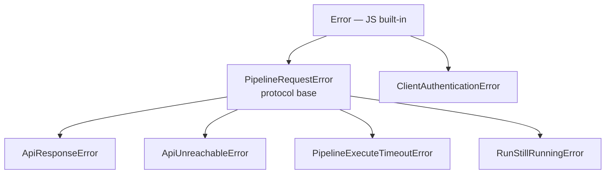

# Error taxonomy — `mthds/errors`

Every error the SDK raises is one of a small, closed set of classes. They are published two ways: from the top-level `mthds` barrel (the full SDK, server-side) and from the **`mthds/errors`** subpath — a client-safe entry point that exports *only* the exception classes, with no Node-only dependency in its import graph. Client code (a browser bundle, a Next.js client component) imports the classes from `mthds/errors` to `instanceof`-check an error without dragging `node:fs` into the bundler graph. The two sets are identical — both re-export from the same source modules, so they cannot drift.

For *why* the separate entry point exists (the bundler/`node:fs` problem it solves), see [architecture.md → "Why `mthds/errors` exists"](./architecture.md#why-mthdserrors-exists). This page is the reference for the classes themselves and how to classify them.

## The hierarchy



Arrows point from a class to its subclasses (the `extends` tree). `PipelineRequestError` is the base every API-runner error derives from — so `catch (e) { if (e instanceof PipelineRequestError) … }` catches all of them at once. The one exception is **`ClientAuthenticationError`**, which extends `Error` directly and is therefore *not* a `PipelineRequestError`. A catch-all that means to cover authentication too must check `instanceof Error` (or test `ClientAuthenticationError` separately).

> An **invalid bundle is not an error.** `POST /v1/validate` returns a produced verdict — a `200` `PipelexInvalidReport` whose `validation_errors[]` you read off the returned value. Exceptions here are reserved for *no-verdict* conditions: the request never produced a usable answer (transport failure, a non-2xx response, a synchronous timeout, a 202 degrade). See [architecture.md → "`/validate` is a 200-diagnostic surface"](./architecture.md#validate-is-a-200-diagnostic-surface).

## What each entry point exports

| Class | `mthds` | `mthds/errors` | `mthds/protocol` |
|---|---|---|---|
| `PipelineRequestError` | ✅ | ✅ | ✅ (it is the protocol base) |
| `ApiResponseError` | ✅ | ✅ | ❌ (runner-layer) |
| `ApiUnreachableError` | ✅ | ✅ | ❌ |
| `ClientAuthenticationError` | ✅ | ✅ | ❌ |
| `PipelineExecuteTimeoutError` | ✅ | ✅ | ❌ |
| `RunStillRunningError` | ✅ | ✅ | ❌ |

`mthds/errors` carries the **whole taxonomy** and nothing else — pick it whenever the importing module might end up in a client bundle. `mthds/protocol` carries only the protocol base (its graph can't reach the runner-layer errors); use it when you only need `PipelineRequestError` alongside the rest of the pure protocol surface.

## Reference

### `PipelineRequestError`

The protocol-level base (`src/protocol/exceptions.ts`, mirrors `mthds/protocol/exceptions.py`). Carries only a `message` (and an optional `{ cause }`). You rarely construct it directly — its value is as the supertype for the API-runner errors below, so a single `instanceof PipelineRequestError` classifies "the pipeline request failed" regardless of *how*.

### `ApiResponseError`

A non-2xx HTTP response **came back** from the runner. Raised by `MthdsApiClient` (`src/runners/api/client.ts`). This is the class to inspect when the server answered but rejected the call (a `4xx`/`5xx`, including auth `401`/`403`).

| Field | Type | Meaning |
|---|---|---|
| `apiUrl` | `string` | The base URL the request went to. |
| `status` | `number` | HTTP status code (e.g. `401`, `422`, `500`). |
| `statusText` | `string` | HTTP status text. |
| `responseBody` | `string` | Raw response body, verbatim. |
| `errorType` | `string \| undefined` | Parsed `error_type` from an RFC 7807 problem body, when present. |
| `serverMessage` | `string \| undefined` | Parsed human message from the problem body. Prefer this for display. |
| `validationErrors` | `ValidationErrorItem[] \| undefined` | Structured per-error list — **only** on the **build routes'** (`POST /v1/build/*`) `422` bodies. `undefined` everywhere else. |

Notes:
- **`validationErrors` is build-route-only.** `POST /v1/validate` no longer routes content errors here — an invalid bundle is the `200` `PipelexInvalidReport` verdict, not an `ApiResponseError`. Do **not** assume a given `errorType` implies a populated `validationErrors`; fall back to `serverMessage` when it is empty.
- `ValidationErrorItem` (from `mthds` / `src/runners/api/models.ts`) carries `category`, `message`, and per-category optionals (`pipe_code`, `concept_code`, `domain_code`, `source`, `field_path`, `field_name`, `variable_names`, `missing_concept_code`, `declared_concepts`). Only `category` and `message` are always present.

### `ApiUnreachableError`

The HTTP exchange **never produced a response** — DNS failure, connection refused, TLS handshake failure, or a request timeout. This is the counterpart to `ApiResponseError`: there, a response came back; here, none did.

| Field | Type | Meaning |
|---|---|---|
| `apiUrl` | `string` | The base URL that could not be reached. |
| `code` | `string \| undefined` | Underlying network error code when available — `ECONNREFUSED`, `ENOTFOUND`, `ETIMEDOUT`, `EAI_AGAIN`, `ABORT_TIMEOUT`. |

### `PipelineExecuteTimeoutError`

The blocking `execute` (`POST /v1/execute`) was killed by the hosted gateway's ~30s synchronous-request limit. The blocking path cannot run methods longer than ~30s behind the hosted gateway.

| Field | Type | Meaning |
|---|---|---|
| `elapsedMs` | `number` | How long the request ran before the timeout fired. |

The message tells the caller to start the run and poll its result by id instead, using the durable run API now provided by [`@pipelex/sdk` / `pipelex-agent`](./run-lifecycle.md). Against a **self-hosted** runner there is no gateway cap — a long run is bounded only by your own reverse proxy's idle timeout (see [api-runner.md](./api-runner.md)).

### `RunStillRunningError`

`execute()` received a `202` (accepted-async) instead of a final result. The MTHDS Protocol lets an implementation degrade a synchronous `/execute` into an async-accepted response when it can't hold the connection open. The run keeps executing server-side — resume by `runId`.

| Field | Type | Meaning |
|---|---|---|
| `runId` | `string` | The authoritative run id to resume by. |
| `retryAfterSeconds` | `number \| null` | From the `Retry-After` header, when the server sent one. |
| `location` | `string \| null` | From the `Location` header — the status resource, when provided. |

### `ClientAuthenticationError`

The taxonomy slot for a **client-side** authentication failure (a missing or rejected credential surfaced by a wrapper — e.g. the VS Code extension's SecretStorage). It carries only a `message`.

Two things to know:
- **It extends `Error` directly, not `PipelineRequestError`.** It is the one class in this module that an `instanceof PipelineRequestError` check will miss.
- **`MthdsApiClient` does not throw it.** A `401`/`403` *from the API* arrives as an `ApiResponseError` with that `status`. The class is exported so wrapping code and downstream consumers share one auth-error type to throw and catch.

## How to classify an error in client code

The point of `mthds/errors` is that the importing module stays free of `node:fs`, so it can live in a browser/client bundle. Import the classes from there (never from `mthds`, which statically pulls `MthdsApiClient → config/ → node:fs`), then branch most-specific-first.

### Prerequisites

- Code that runs in (or is bundled for) a client/browser context — e.g. a Next.js client component, or any module a client bundler (Webpack, Turbopack, Vite, esbuild) processes.
- An error value caught from an SDK call (or forwarded from one).

### Steps

1. **Import the classes from `mthds/errors`**, not the top-level barrel:

   ```typescript
   import {
     PipelineRequestError,
     ApiResponseError,
     ApiUnreachableError,
     ClientAuthenticationError,
   } from "mthds/errors";
   ```

2. **Branch most-specific subclass first**, base last, so the catch-all doesn't shadow a specific case:

   ```typescript
   export function toUserMessage(err: unknown): string {
     if (err instanceof ClientAuthenticationError) {
       // NOT a PipelineRequestError — handle before the base check
       return "Your API key is missing or invalid.";
     }
     if (err instanceof ApiUnreachableError) {
       return `Can't reach the runner (${err.code ?? "network error"}).`;
     }
     if (err instanceof ApiResponseError) {
       return err.serverMessage ?? `Runner error ${err.status}.`;
     }
     if (err instanceof PipelineRequestError) {
       // catch-all for any other pipeline-request failure
       return err.message;
     }
     return "Unexpected error.";
   }
   ```

### Verification

Build the client bundle. It should compile without a `node:fs` resolution error:

```bash
npm run build      # or: next build / vite build
```

If the importing module is server-only, you can import the same classes from `mthds` instead — they are the identical constructors, so `instanceof` works across both entry points within one runtime.

### Troubleshooting

- **`Module not found: Can't resolve 'fs'` (or `node:fs`) in a client build.** You imported an error class from `mthds` instead of `mthds/errors`. The top-level barrel re-exports `MthdsApiClient`, whose graph reaches `node:fs`; switch the import to `mthds/errors`.
- **A `ClientAuthenticationError` slips past my `instanceof PipelineRequestError` catch.** Expected — it extends `Error` directly. Check it explicitly, or widen the catch-all to `instanceof Error`.
- **`err.validationErrors` is `undefined` on a validation failure.** Validation failures from `POST /v1/validate` are not errors — read the `200` `PipelexInvalidReport.validation_errors[]` off the returned value. `ApiResponseError.validationErrors` is populated only for the build routes' `422` bodies.
- **`instanceof` fails across a Next.js Server Action boundary.** Errors thrown in a Server Action are serialized to the client and lose their class identity in production (Next.js replaces them with a generic `Error` + digest). Classify those by a stable field you propagate yourself (e.g. an error code in the message or a returned discriminant), not by `instanceof`. `mthds/errors` still earns its keep there: it lets the client module *import the types* for annotations and same-runtime checks without the bundler choking on `node:fs`.

## See also

- [architecture.md](./architecture.md) — the SDK's `protocol/ ⊥ runners/` split, the entry-point table, and the rationale for `mthds/errors`.
- [api-runner.md](./api-runner.md) — pointing the client at a hosted vs. self-hosted runner, and how the ~30s synchronous cap drives `PipelineExecuteTimeoutError`.
- [run-lifecycle.md](./run-lifecycle.md) — `execute` vs. `start`, and the durable poll-by-id that supersedes the blocking path on a timeout or a `202`.
