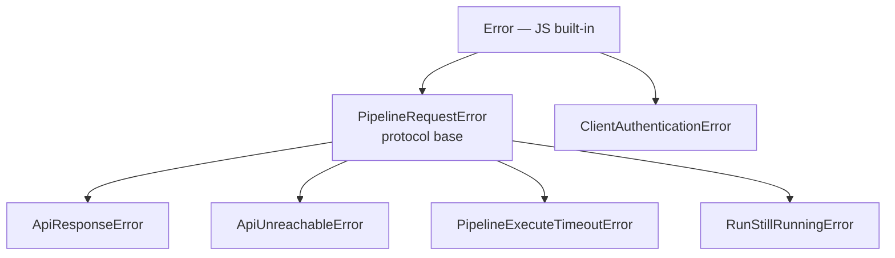

# Error taxonomy — `mthds/errors`

Every error the SDK raises is one of a small, closed set of classes. They are published two ways: from the top-level `mthds` barrel (the full SDK, server-side) and from the **`mthds/errors`** subpath — a client-safe entry point that exports *only* the exception classes, with no Node-only dependency in its import graph. Client code (a browser bundle, a Next.js client component) imports the classes from `mthds/errors` to `instanceof`-check an error without dragging `node:fs` into the bundler graph. The two sets are identical — both re-export from the same source modules, so they cannot drift.

For *why* the separate entry point exists (the bundler/`node:fs` problem it solves), see [architecture.md → "Why `mthds/errors` exists"](./architecture.md#why-mthdserrors-exists). This page is the reference for the classes themselves and how to classify them.

## The hierarchy


```mermaid
flowchart TD
    Err["Error — JS built-in"]
    PRE["PipelineRequestError<br/>protocol base"]
    CAE["ClientAuthenticationError"]
    ARE["ApiResponseError"]
    AUE["ApiUnreachableError"]
    PET["PipelineExecuteTimeoutError"]
    RSR["RunStillRunningError"]
    Err --> PRE
    Err --> CAE
    PRE --> ARE
    PRE --> AUE
    PRE --> PET
    PRE --> RSR
```

Arrows point from a class to its subclasses (the `extends` tree). `PipelineRequestError` is the base every API-runner error derives from — so `catch (e) { if (e instanceof PipelineRequestError) … }` catches all of them at once. The one exception is **`ClientAuthenticationError`**, which extends `Error` directly and is therefore *not* a `PipelineRequestError`. A catch-all that means to cover authentication too must check `instanceof Error` (or test `ClientAuthenticationError` separately).

> An **invalid bundle is not an error.** `POST /v1/validate` returns a produced verdict — the `200` invalid arm of `ValidationResult` whose `validation_errors[]` you read off the returned value. Exceptions here are reserved for *no-verdict* conditions: the request never produced a usable answer (transport failure, a non-2xx response, a synchronous timeout, a 202 degrade). See [architecture.md → "`/validate` is a 200-diagnostic surface"](./architecture.md#validate-is-a-200-diagnostic-surface).

## What each entry point exports

| Class | `mthds` | `mthds/errors` | `mthds/protocol` |
|---|---|---|---|
| `PipelineRequestError` | ✅ | ✅ | ✅ (it is the protocol base) |
| `ApiResponseError` | ✅ | ✅ | ❌ (runner-layer) |
| `ApiUnreachableError` | ✅ | ✅ | ❌ |
| `ClientAuthenticationError` | ✅ | ✅ | ❌ |
| `PipelineExecuteTimeoutError` | ✅ | ✅ | ❌ |
| `RunStillRunningError` | ✅ | ✅ | ❌ |

`mthds/errors` carries the **whole taxonomy** and nothing else — pick it whenever the importing module might end up in a client bundle. `mthds/protocol` carries only the protocol base (its graph can't reach the runner-layer errors); use it when you only need `PipelineRequestError` alongside the rest of the pure protocol surface.

## Reference

### `PipelineRequestError`

The protocol-level base (`src/protocol/exceptions.ts`, mirrors `mthds/protocol/exceptions.py`). Carries only a `message` (and an optional `{ cause }`). You rarely construct it directly — its value is as the supertype for the API-runner errors below, so a single `instanceof PipelineRequestError` classifies "the pipeline request failed" regardless of *how*.

### `ApiResponseError`

A non-2xx HTTP response **came back** from the runner. Raised by `MthdsApiClient` (`src/runners/api/client.ts`). This is the class to inspect when the server answered but rejected the call (a `4xx`/`5xx`, including auth `401`/`403`).

| Field | Type | Meaning |
|---|---|---|
| `apiUrl` | `string` | The base URL the request went to. |
| `status` | `number` | HTTP status code (e.g. `401`, `422`, `500`). |
| `statusText` | `string` | HTTP status text. |
| `responseBody` | `string` | Raw response body, verbatim. |
| `errorType` | `string \| undefined` | Parsed `error_type` from an RFC 7807 problem body, when present. |
| `serverMessage` | `string \| undefined` | Parsed human message from the problem body. Prefer this for display. |
| `validationErrors` | `ValidationErrorItem[] \| undefined` | Structured per-error list — **only** on a **run route's** `422` (`POST /v1/execute`, `POST /v1/start`) when the runner refuses to run an invalid method. `undefined` everywhere else. |
| `type` | `string \| undefined` | The RFC 9457 `type`: the stable URI of the error class. |
| `title` | `string \| undefined` | The RFC 9457 `title`: the short human label of the error class. |
| `instance` | `string \| undefined` | The RFC 9457 `instance`: the occurrence, a request path or a request URN. |
| `errorDomain` | `string \| undefined` | The body's `error_domain`, saying who can fix the failure: `input` (the caller — a malformed bundle, a bad argument, a missing input), `config` (the runner's operator — a missing secret, a misconfigured backend) or `runtime` (nobody beforehand — a provider outage during the run). |
| `retryable` | `boolean \| undefined` | The body's `retryable`: whether retrying the same request can plausibly succeed. |
| `userAction` | `UserAction \| undefined` | The body's `user_action`: what the caller should do next, as `{ kind, detail }`. `detail` is the advice in words; `kind` is the runner's category of advice (the reference runner emits `wait_and_retry`, `check_billing`, `check_credentials`, `change_input`, `change_model`, `contact_support` and `unknown`). |
| `requestId` | `string \| undefined` | The request's correlation id: the body's `request_id`, or the `X-Request-ID` response header when the body carries none. It is the id to hand to support, because it finds the server's log lines for this request. |

Notes:
- **Branch on `errorDomain` and `type`, not on the status or the message.** `errorDomain` tells the caller's own mistake (`input`) from a fault it cannot fix, and `type` names the error class with a URI that stays the same on every occurrence. `errorType` is the runner's own class name, finer and open-ended.
- **Every problem member is optional.** A runner sends what it knows, so each field is `undefined` when the response did not carry it, and a member of the wrong type (a numeric `type`, a `retryable` of `"no"`, a `user_action` without a `detail`) reads as absent rather than as a wrong value. `retryable: undefined` means unknown, which is not the same as `false`. A body that is not a problem document still yields `serverMessage` or the raw `responseBody`, and a gateway error page still yields the `requestId` from its header.
- **Members specific to one runner stay in `responseBody`.** The standard's client types the members any runner can send under a neutral name. Members a particular runner adds — the Pipelex platform's `code` and field-level `errors[]`, the inference `error_category`, `model` and `provider` — are left untyped here; `@pipelex/sdk` types them for the Pipelex API.
- **`validationErrors` rides a refusal, never a verdict.** A run route refuses an invalid method with a `422` carrying it. `POST /v1/validate` and the per-pipe build routes (`build/inputs`, `build/output`, `build/runner`) do not route content errors here — an invalid bundle is their `200` invalid-arm verdict (`ValidationResult`, `CrateInvalidReport`), not an `ApiResponseError`. The spec-to-TOML routes `build/concept` and `build/pipe-spec` have no verdict: they refuse an invalid spec with a `422` (`error_type: "ValidationError"`, `errorDomain: "input"`) whose message names the fault and which carries no `validationErrors`. Do **not** assume a given `errorType` implies a populated `validationErrors`; fall back to `serverMessage` when it is empty.
- `ValidationErrorItem` (from `mthds` / `src/runners/api/models.ts`) carries `category`, `message`, and per-category optionals (`error_type`, `pipe_code`, `concept_code`, `domain_code`, `source`, `field_path`, `field_name`, `variable_names`, `missing_concept_code`, `missing_pipe_code`, `declared_concepts`, the unknown-model locators `model_reference`, `model_type` and `suggestions`, and `suggested_fix`). Only `category` and `message` are always present. See [A validation item's next step](#a-validation-items-next-step).

### `ApiUnreachableError`

The HTTP exchange **never produced a response** — DNS failure, connection refused, TLS handshake failure, or a request timeout. This is the counterpart to `ApiResponseError`: there, a response came back; here, none did.

| Field | Type | Meaning |
|---|---|---|
| `apiUrl` | `string` | The base URL that could not be reached. |
| `code` | `string \| undefined` | Underlying network error code when available — `ECONNREFUSED`, `ENOTFOUND`, `ETIMEDOUT`, `EAI_AGAIN`, `ABORT_TIMEOUT`. |

### `PipelineExecuteTimeoutError`

The blocking `execute` (`POST /v1/execute`) was killed by the hosted gateway's ~30s synchronous-request limit. The blocking path cannot run methods longer than ~30s behind the hosted gateway.

| Field | Type | Meaning |
|---|---|---|
| `elapsedMs` | `number` | How long the request ran before the timeout fired. |

The message tells the caller to start the run and poll its result by id instead, using the durable run API now provided by [`@pipelex/sdk` / `pipelex-agent`](./run-lifecycle.md). Against a **self-hosted** runner there is no gateway cap — a long run is bounded only by your own reverse proxy's idle timeout (see [api-runner.md](./api-runner.md)).

### `RunStillRunningError`

`execute()` received a `202` (accepted-async) instead of a final result. The MTHDS Protocol lets an implementation degrade a synchronous `/execute` into an async-accepted response when it can't hold the connection open. The run keeps executing server-side — resume by `runId`.

| Field | Type | Meaning |
|---|---|---|
| `runId` | `string` | The authoritative run id to resume by. |
| `retryAfterSeconds` | `number \| null` | From the `Retry-After` header, when the server sent one. |
| `location` | `string \| null` | From the `Location` header — the status resource, when provided. |

### `ClientAuthenticationError`

The taxonomy slot for a **client-side** authentication failure (a missing or rejected credential surfaced by a wrapper — e.g. the VS Code extension's SecretStorage). It carries only a `message`.

Two things to know:
- **It extends `Error` directly, not `PipelineRequestError`.** It is the one class in this module that an `instanceof PipelineRequestError` check will miss.
- **`MthdsApiClient` does not throw it.** A `401`/`403` *from the API* arrives as an `ApiResponseError` with that `status`. The class is exported so wrapping code and downstream consumers share one auth-error type to throw and catch.

## How to classify an error in client code

The point of `mthds/errors` is that the importing module stays free of `node:fs`, so it can live in a browser/client bundle. Import the classes from there (never from `mthds`, which statically pulls `MthdsApiClient → config/ → node:fs`), then branch most-specific-first.

### Prerequisites

- Code that runs in (or is bundled for) a client/browser context — e.g. a Next.js client component, or any module a client bundler (Webpack, Turbopack, Vite, esbuild) processes.
- An error value caught from an SDK call (or forwarded from one).

### Steps

1. **Import the classes from `mthds/errors`**, not the top-level barrel:

   ```typescript
   import {
     PipelineRequestError,
     ApiResponseError,
     ApiUnreachableError,
     ClientAuthenticationError,
   } from "mthds/errors";
   ```

2. **Branch most-specific subclass first**, base last, so the catch-all doesn't shadow a specific case:

   ```typescript
   export function toUserMessage(err: unknown): string {
     if (err instanceof ClientAuthenticationError) {
       // NOT a PipelineRequestError — handle before the base check
       return "Your API key is missing or invalid.";
     }
     if (err instanceof ApiUnreachableError) {
       return `Can't reach the runner (${err.code ?? "network error"}).`;
     }
     if (err instanceof ApiResponseError) {
       const reason = err.serverMessage ?? `Runner error ${err.status}.`;
       const nextStep = err.userAction ? ` ${err.userAction.detail}` : "";
       // `input` is the caller's to fix; anything else is not, so give support the id.
       const support =
         err.errorDomain !== "input" && err.requestId ? ` (request id ${err.requestId})` : "";
       return `${reason}${nextStep}${support}`;
     }
     if (err instanceof PipelineRequestError) {
       // catch-all for any other pipeline-request failure
       return err.message;
     }
     return "Unexpected error.";
   }
   ```

### Verification

Build the client bundle. It should compile without a `node:fs` resolution error:

```bash
npm run build      # or: next build / vite build
```

If the importing module is server-only, you can import the same classes from `mthds` instead — they are the identical constructors, so `instanceof` works across both entry points within one runtime.

### Troubleshooting

- **`Module not found: Can't resolve 'fs'` (or `node:fs`) in a client build.** You imported an error class from `mthds` instead of `mthds/errors`. The top-level barrel re-exports `MthdsApiClient`, whose graph reaches `node:fs`; switch the import to `mthds/errors`.
- **A `ClientAuthenticationError` slips past my `instanceof PipelineRequestError` catch.** Expected — it extends `Error` directly. Check it explicitly, or widen the catch-all to `instanceof Error`.
- **`err.validationErrors` is `undefined` on a validation failure.** Validation failures from `POST /v1/validate` are not errors — read the `200` invalid arm's `validation_errors[]` off the returned value. `ApiResponseError.validationErrors` is populated only on a run route's `422` refusing an invalid method; a per-pipe build route's invalid bundle is its `200` verdict too, and a `build/concept` or `build/pipe-spec` refusal of an invalid spec names the fault in its message alone.
- **`instanceof` fails across a Next.js Server Action boundary.** Errors thrown in a Server Action are serialized to the client and lose their class identity in production (Next.js replaces them with a generic `Error` + digest). Classify those by a stable field you propagate yourself (e.g. an error code in the message or a returned discriminant), not by `instanceof`. `mthds/errors` still earns its keep there: it lets the client module *import the types* for annotations and same-runtime checks without the bundler choking on `node:fs`.

## What the CLIs print for a runner's refusal

Both CLIs carry an `ApiResponseError`'s problem members to the reader, so a person or an agent can tell their own mistake from a fault they cannot fix, knows whether to retry, and has an id to hand to support. A member the runner did not send prints nothing.

Both read the members off an `ApiResponseError`, which every route of `MthdsApiClient` raises on a non-2xx: the protocol routes (`execute`, `start`, `validate`, `models`, `version`), `uploadFile`, the build extensions (`/v1/build/*`, and `concept` and `pipeSpec`) and `health`.

**`mthds`** prints the error's message, then one line per member the runner sent (`src/cli/commands/error-output.ts`), on `run`, `validate`, `build` and the validation step of `install`:

```text
API POST /v1/execute failed (422): Model 'gpt-9' is not in the model deck.
Error domain: input (the request must change)
Next step: Pick a model listed by `mthds-agent models`.
Retryable: no
Request id: 9f2c1ab3 (quote it to support)
```

A refusal that lists validation items, a run route refusing an invalid method for one, prints each item between the message and the members, as [A validation item's next step](#a-validation-items-next-step) shows.

**`mthds-agent`** reads the problem document into its JSON error envelope the way the local `pipelex-agent` reads a report (`runnerProblemExtras` in `src/agent/output.ts`), on every command that calls the API runner:

| Envelope field | From the problem document | When the runner did not send it |
|---|---|---|
| `error_domain` | `error_domain`, when it is `input`, `config` or `runtime` | the command's own domain (`runner`, or `validation` on a `validate` 422) |
| `hint` | `user_action.detail` | the command's static hint for its `error_type` |
| `retryable` | `true` when the runner said a retry can succeed | absent — the envelope only ever says `true`, as in `pipelex-agent` |
| `request_id` | `requestId` (the body's `request_id`, else the `X-Request-ID` header) | absent |
| `validation_errors` | `validationErrors`, each item whole, when the refusal lists any (a run route refusing an invalid method with a `422`) | absent |

`error_type` and `message` keep each command's own choice. So a software consumer that treats `config` and `runtime` as an environment issue and `input` as the caller's (a validation hook, for instance) reads a runner's refusal correctly, where it used to see `runner` for every one of them.

## A validation item's next step

When a runner refuses a bundle, each `ValidationErrorItem` says what is wrong and where, and, when the runner can derive one deterministic correction, what to do about it: its `suggested_fix`. The worked example is an unknown model. A pipe naming `model = "gpt-5.1"`, which the model deck does not define, comes back as an item with `error_type: "unknown_model"`, the pipe, the source file and the field, the reference as the author wrote it (`model_reference`), the kind of model the field takes (`model_type`) and the deck's close matches (`suggestions`). When there is exactly one close match, the item also carries the fix:

```json
{
  "category": "pipe_validation",
  "error_type": "unknown_model",
  "message": "Model handle 'gpt-5.1' was not found in the model deck. Did you mean: gpt-5?",
  "pipe_code": "summarize",
  "field_name": "model",
  "model_reference": "gpt-5.1",
  "model_type": "llm",
  "suggestions": ["gpt-5"],
  "suggested_fix": {
    "fix_code": "rename-model",
    "description": "Replace model 'gpt-5.1' of pipe 'summarize' with 'gpt-5', its one close match in the model deck",
    "safety": "safe",
    "source": "demo.mthds",
    "ops": [
      { "kind": "remap_value", "table_path": ["pipe", "summarize"], "key": "model", "mapping": { "gpt-5.1": "gpt-5" } }
    ]
  }
}
```

A `SuggestedFix` has two readers. A person or an agent reads its `description`, a sentence they can act on. A program applying the fix reads its `ops`, semantic patches over the `.mthds` document addressed by TOML table path (`FixOp`, discriminated on `kind`), so an applier keeps the author's formatting. `fix_code` names the rule that produced the fix, `safety` says whether it is `safe` to apply without asking, and `source`, when present, is the only file the ops may touch. An item with no fix has no `suggested_fix` key, and a refused reference that names a pipe the bundle does not declare carries in `missing_pipe_code` the fully qualified ref the runner attempted (`demo.summarise`), not the bare spelling the author typed, while the item's `pipe_code`, the referencing pipe, stays bare.

The items reach a caller the same way wherever they ride: on the `200` invalid verdict of a per-pipe build route (`CrateInvalidReport.validation_errors`), on a refusal's problem document (`ApiResponseError.validationErrors`), and on the `200` invalid verdict of `validate`, whose neutral `ValidationError` type exposes only `category` and `message` but whose items keep every field at runtime, so a caller narrows them with `as ValidationErrorItem[]`.

**`mthds-agent`** carries each item whole in its `ValidateBundleError` envelope (`validate` and `inputs` on the API runner), and in the envelope of a runner's refusal that lists them — `run start` against a runner that refuses to run an invalid method, for one — so the agent reads the `suggested_fix` next to the error. With the default Markdown format, `validate` prints the runner's own rendering, which has a `Suggested fix:` line under each item that has one. The Codex hook (`mthds-agent codex hook`) builds its blocking reason from `pipelex-agent`'s envelope and prints the same line, with the missing pipe or concept among the item's locators:

```text
- [pipe_validation] Model handle 'gpt-5.1' was not found in the model deck. (pipe: summarize, field: model, source: demo.mthds)
  Suggested fix: Replace model 'gpt-5.1' of pipe 'summarize' with 'gpt-5', its one close match in the model deck
```

**`mthds`** prints the same line for a person, under each item that has a fix, when the runner refuses a bundle on `validate`, `build` or the validation step of `install`. The line is built in one place (`withSuggestedFix` in `src/cli/commands/error-output.ts`), which the Codex hook uses too, and it sits two spaces past the item it belongs to:

```text
demo.mthds: [pipe_validation] Model handle 'gpt-5.1' was not found in the model deck.
  Suggested fix: Replace model 'gpt-5.1' of pipe 'summarize' with 'gpt-5', its one close match in the model deck
```

When the runner refuses to run an invalid method, `mthds run` prints the refusal's items under its message, each with its locators and its fix, in the Codex hook's list form (`formatValidationItem`, in the same file), then the problem members:

```text
API POST /v1/execute failed (422): The method is invalid and was not run.
- [pipe_validation] Model handle 'gpt-5.1' was not found in the model deck. (pipe: summarize, field: model, source: demo.mthds)
  Suggested fix: Replace model 'gpt-5.1' of pipe 'summarize' with 'gpt-5', its one close match in the model deck
- [pipe_validation] Pipe 'demo.main' refers to 'summarise', which no bundle declares. (pipe: main, missing pipe: demo.summarise, source: demo.mthds)
Error domain: input (the request must change)
```

## See also

- [architecture.md](./architecture.md) — the SDK's `protocol/ ⊥ runners/` split, the entry-point table, and the rationale for `mthds/errors`.
- [api-runner.md](./api-runner.md) — pointing the client at a hosted vs. self-hosted runner, and how the ~30s synchronous cap drives `PipelineExecuteTimeoutError`.
- [run-lifecycle.md](./run-lifecycle.md) — `execute` vs. `start`, and the durable poll-by-id that supersedes the blocking path on a timeout or a `202`.
