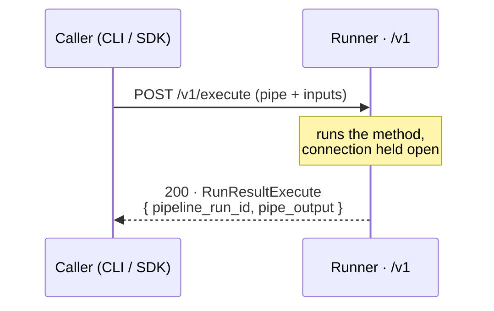
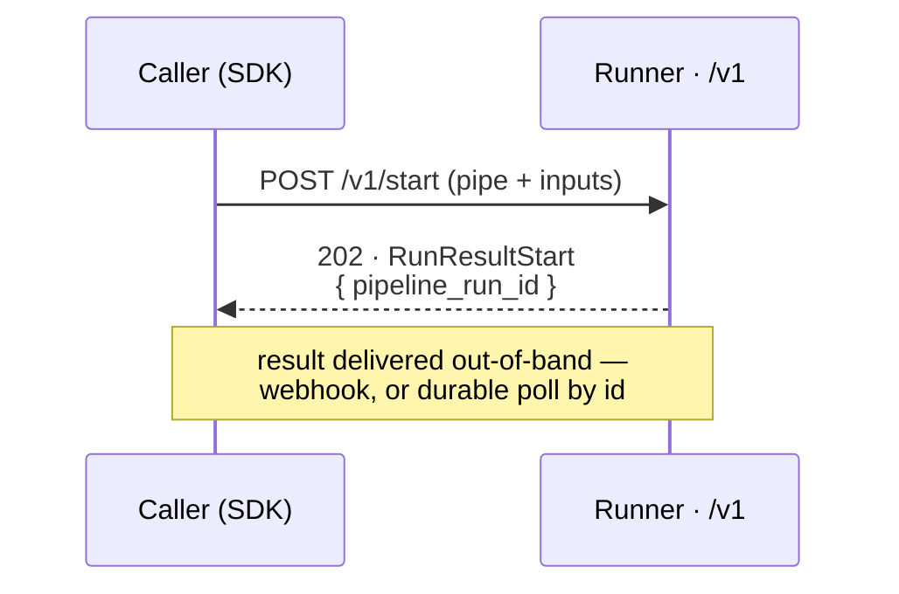

# Run lifecycle — executing and starting methods

A *run* is one execution of a method against an MTHDS runner. `mthds-js` gives you two ways to start one, depending on whether you want to **block until the result is ready** or **submit now and collect the result later**.

Both are part of the MTHDS Protocol, so they work against any compliant runner — the Pipelex Hosted API or a [self-hosted bare runner](./api-runner.md).

| Primitive | Route | Returns | Waits for the result? | Available from |
|---|---|---|---|---|
| `execute` | `POST /v1/execute` | `RunResultExecute` — `pipeline_run_id` **+ `pipe_output`** | Yes | CLI (`mthds run …`) and SDK (`client.execute`) |
| `start` | `POST /v1/start` | `RunResultStart` — `pipeline_run_id` only | No | SDK (`client.start`) |

## `execute` — run and wait

`execute` holds the connection open until the method finishes, then returns the completed run: its `pipeline_run_id` and the method's `pipe_output`.



From the CLI, `run pipe` and `run bundle` go through `execute`:

```bash
mthds run pipe my-pipeline --inputs inputs.json        # a registered pipe, by code
mthds run bundle ./method.mthds --inputs inputs.json   # a bundle file
```

From the SDK:

```typescript
const result = await client.execute({
  pipe_code: "my-pipeline",
  inputs: { topic: "quantum computing" },
});
console.log(result.pipe_output);
```

**Two things can cut the wait short:**

- **Hosted timeout.** Behind the Pipelex Hosted gateway, synchronous requests are capped at ~30s; a longer run surfaces as `PipelineExecuteTimeoutError`. Switch to `start` for long methods. (A self-hosted runner imposes no such cap of its own — but your reverse proxy usually does; see [api-runner.md](./api-runner.md).)
- **Async degrade (202).** The protocol lets a runner *accept* an `execute` request and finish it in the background, answering `202` with the run id instead of the result. `mthds-js` surfaces that as `RunStillRunningError`, carrying the `pipeline_run_id`, `Retry-After`, and `Location` so you can collect the result by id.

## `start` — submit now, collect later

`start` submits the run and returns immediately with the authoritative `pipeline_run_id`. There is no output yet — the method keeps running server-side.



```typescript
const { pipeline_run_id } = await client.start({
  pipe_code: "long-running-pipeline",
  inputs: { document: "…" },
});
```

**How completion reaches you is implementation-defined** — the protocol deliberately leaves it open:

- A **bare `pipelex-api` runner** can call you back: pass `callback_urls` through the `extra` option for HMAC-signed completion webhooks.
- The **Pipelex Hosted API** keeps a durable record of the run that you poll by id (next section).

## Collecting an async result by id (durable runs)

Polling a run by its `pipeline_run_id` until it reaches a terminal state — against a self-healing endpoint that survives restarts — is a **hosted-API feature layered on top of the protocol**, not part of it. It lives in the Pipelex runtime SDK, **[`@pipelex/sdk`](https://github.com/Pipelex/pipelex-sdk-js)** (and the `pipelex-agent` CLI), whose client adds `getRunStatus`, `getRunResult`, `waitForResult`, and `startAndWaitForResult` over the `/v1/runs/*` routes.

Reach for that SDK when you want a durable, resumable handle on a run:

```typescript
import { PipelexApiClient } from "@pipelex/sdk";

const client = new PipelexApiClient({ baseUrl: "https://api.pipelex.com", apiToken });
const result = await client.startAndWaitForResult({
  pipe_code: "long-running-pipeline",
  inputs: { document: "…" },
});
```

`mthds-js` stays focused on the protocol surface: `start` hands you the id, and everything after that is the runtime SDK's job.

## Which one should I reach for?

- **Short run, want the answer inline** → `execute` (or any `mthds run …` command).
- **Long run, fire-and-forget** → `start`, then receive completion out-of-band (e.g. a webhook).
- **Long run, want a durable handle to poll or resume** → `@pipelex/sdk` / `pipelex-agent`.

## See also

- [`@pipelex/sdk`](https://github.com/Pipelex/pipelex-sdk-js) — the Pipelex runtime SDK that provides the durable run-lifecycle (poll-by-id) and the `pipelex-agent` CLI.
- [api-runner.md](./api-runner.md) — pointing `mthds-js` at a hosted or self-hosted runner, and the timeout/run-store differences between them.
- [architecture.md](./architecture.md) — the `RunResultExecute` / `RunResultStart` types and why the run response is split.
- [errors.md](./errors.md) — `PipelineExecuteTimeoutError` and `RunStillRunningError` (the `202` degrade) in full, with the rest of the exception taxonomy.
